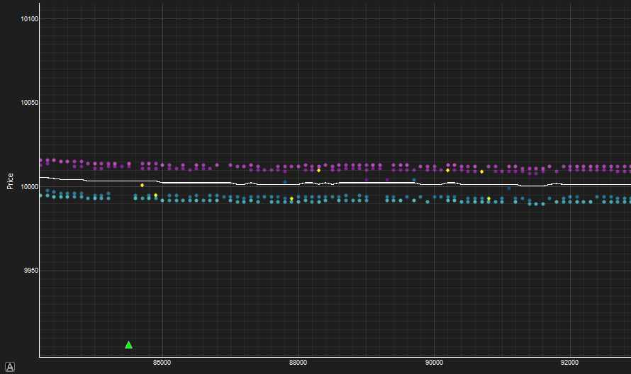

# Two Big Guys | IMC Prosperity4 Repository
This repository outlines the methods used by my team Two Big Guys that allowed us to place **20th globally** for Algorithmic Trading in Phase 1 of the annual trading challenge hosted by IMC.

## The Team
- Sean Wang
- Nathan Wong (Away for Tutorial and Round 1 due to other commitments)

# Tools
The biggest edge in the initial rounds was the tools that participants had at their disposal. Whilst I did develop these tools alongside AI, it was used only to write up tedious code. In particular, similar to winning participants in previous years we made sure that we were the ones deciding on logic and UI.
## Backtester
The backtester we used was taken from the open-source channel on the discord. It was made by Kevin Fu and you can find it [here](https://github.com/kevin-fu1/imc-prosperity-4-backtester). I modified the backtester slightly to include data of subsequent rounds and upon runnning it, instead of redirecting to his iniial online visualiser it simply opened up the backtester log in my own custom built visualiser.
## Visualiser
This was probably the most important tool of earlier rounds and the one taking the most time to develop. This is because visualising what is actually happening in the order books is crucial to find *hidden alpha*. *Hidden alpha* is the term I colloquially used to call any sources of PnL that was not attainable by optimising or improving an algorithm, but rather by noticing odd behaviour in the order book.

*Our Visualiser was probably what helped the most for finding hidden alpha*

Quotes were colored brighter if they had more volume and darker if they had less volume. We later realised that the quotes were from several distinct market participants. We named them *Large Makers*, *Small Makers*, *Trader 1s* and *Trader 2s*. We knew that different participant groups could later prove to be important from historical Prosperity repositories.

We had some fair price models that we were able to select. A couple that proved to work quite well for us was Fill MM, and Fish Mid which I will explain later. I also included an option to normalize since that helped us visualise price differences from our 'fair' much better. The skew price will prove to be important later on.

Unlike other visualisers I had seen, I chose to keep the number of symbols quite minimalistic so that anything odd can be spotted much more easily. Furthermore since my teammate (Nathan Wong) had not been involved in the development of the tools, I wanted the visualisers to be as easy to use as possible. Besides the orderbook which was already discussed, the red and green triangles are our strategy's makes. The red and green crosses are our strategy's takes. The orange line that shows up occasionally happens when the order book is empty.
## True Pricer
This was our main method of developing accurate pricing models. Essentially we would submit a strategy that would buy 1 of each product and record PnL to reverse engineer the true internalised fair price at every timestamp. The True Pricer essentially fits each pricing model and it allows us to see accuracy of the model, and exactly where the model was inaccurate.

\
*Our True Pricer helped us work out the optimal pricing model for each round*

The statistics outputted are RMSE and a custom statistic we call "accuracy". We realised that the true fair price didn't have to be an integer. However, since the tick size was 1, if our pricing model predicted a fair that had the same integer floor as the true fair, this would be 'correct' since theoretically a strategy would make the exact same decisions as if it had the true fair.

## Other Tools
We developed other tools including Reg Detectors, Strategy Evaluator and a general Strategy Log that served smaller and more specific purposes. I'll leave them out of the repository since it would take too long to go through all of them.

# Tutorial
Since this was my first time competing in an algorithmic trading challenge of this scale, I felt it would be best to familiarise myself with Prosperity repos from previous years. One repo that was a huge amount of help for me us was the [Prosperity3 Frankfurt Hedgehogs repository](https://github.com/TimoDiehm/imc-prosperity-3#round-3-reserve-price). I adapted their idea of developing custom tools for the competition and reverse engineering the submission website for the true internalized fair value.
## Fair Price
Our pricing model for this round was quite simple. Initially we used the market maker mid. However we round this wasn't quite as accurate as another pricing model we developed called fish mid. Essentially we filter our any trades we deem as 'uninformed' (we call fish because of a background in poker), and we simply take the mid of the best bid and the best ask after that. We found that there was significant improvement for both accuracy and RMSE over the market maker mid used historically.
## General Strategy
Overall, the tutorial was quite similar to previous years. Our strategy just involved calculating fish mid at every timestamp. We then lift any asks below our fair, and hit any bids above our fair. For the bids and asks, we try to dime the tightest quote. If that pushes us past the fair, we try dime the subsequent level and the next etc.

# Round 1
We had expected that round 1 would be a continuation of the tutorial round. However, both products were very different which forced us to restart. We were quite happy about the change though since it was much more exciting to work with data that was quite different from previous years.
## Fair Price
We found that the fish mid pricing model that worked well in the tutorial round didn't work as well during this round. Instead we reverted back to the market maker mid. We observed that the market maker quoted at a consistent spread, which helped us predict quotes from the market maker for times when market maker did not participate in either one or both sides of the order book. We called this pricing model Fill MM. This became our pricing model for Osmium. For Peppers, the true price was much more obvious. I simply fit a least squares regression on the prices since the price was increasing at exactly a linear rate.
## Orderbook Illiquidity
The first source of *hidden alpha* we found was that during timestamps when one or both sides of the order book was empty, there was a bot that would take at prices 120 above and below Pepper fair and 100 above and below Osmium fair. This meant that during periods of illiquidity we could quote bids and asks at these prices and we could stand to make a huge amount of profit. This strategy alone made us more than 2,000 Xirecs on the website backtester.

*We get hit about 100 below fair at this instance for Osmium*
## Peppers Strategy
Since the price of peppers increased at a linear rate, market making was not quite as viable since the fair price could catch up with our ask price before we are able to be hit. However, just longing peppers also missed out on potentially profitable trades. Our final strategy involved a mix of both using a skew fair and a neutral long position. Essentially, we 